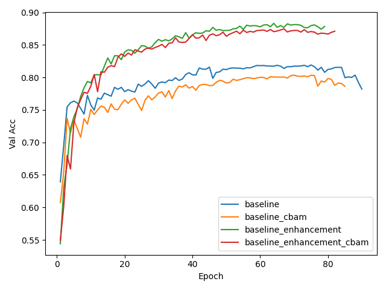
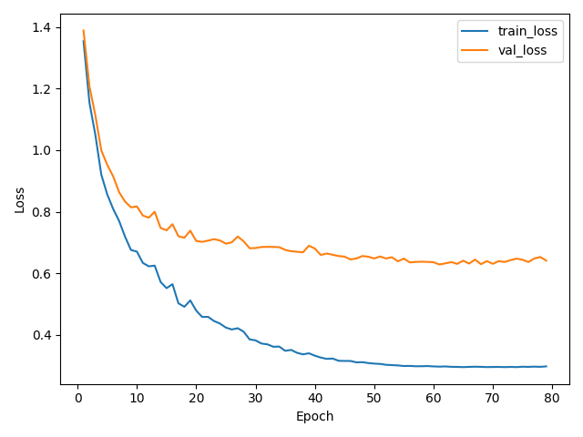

# Weekly Result (One-Pager)

## Environment Information

| Item | Version |
|------|---------|
| PyTorch | 2.8.0+cu129 |
| TorchVision | 0.23.0+cu129 |
| CUDA | 12.9 |
| Driver | 581.08 |
| GPU | NVIDIA GeForce RTX 5060 Laptop GPU |

## Summary Table

| exp_id           | exp_name                  |   seed |   epochs |   learning_rate | optimizer   | lr_scheduler      | data_enhancement   | cbam_enabled   |   top-1_acc |   duration |
|:-----------------|:--------------------------|-------:|---------:|----------------:|:------------|:------------------|:-------------------|:---------------|------------:|-----------:|
| exp251014_161144 | baseline_cbam             |    608 |       70 |          0.0001 | AdamW       | CosineAnnealingLR | nan                | True           |      0.7892 |    6830.93 |
| exp251014_181251 | baseline                  |    608 |       75 |          0.0001 | AdamW       | CosineAnnealingLR | nan                | False          |      0.7873 |    6910.66 |
| exp251014_200933 | baseline_enhancement      |    608 |       64 |          0.0001 | AdamW       | CosineAnnealingLR | affine             | False          |      0.9034 |    6087.78 |
| exp251015_084809 | baseline_enhancement_cbam |    608 |       67 |          0.0001 | AdamW       | CosineAnnealingLR | affine             | True           |      0.8883 |    6538.06 |

## Curves

### Validation Accuracy

### Loss Curves for baseline_enhancement

## 总结

### Sanity Check

| Experiment                         | Model    | CBAM   | Accuracy |
|:-----------------------------------|----------|--------|---------:|
| baseline_cbam                      | ResNet18 | True   |   0.7892 |
| baseline                           | ResNet18 | False  |   0.7873 |
| baseline_enhancement               | ResNet18 | False  |   0.9034 |
| baseline_enhancement_cbam          | ResNet18 | True   |   0.8883 |
| CIFAR10-Deep-Learning-Comparison-- | ResNet18 | False  |   0.8924 |

 - 同样使用ResNet18， https://github.com/code-alchemist01/CIFAR10-Deep-Learning-Comparison-- 该实验的准确率为0.8924，与本实验相近

 本实验以ResNet18为基础，分别对比了使用数据增强（RandomAffine）和在模型结构中添加cbam模块对结果的影响。
  - 在不开启数据增强的情况下，使用cbam对准确率的提高影响较小；而在开启数据增强时，使用cbam却会略微降低模型的表现。
  - 开启cbam时，每epoch的训练时间均比不开启时多约2s。
  - 四个实验中均出现了较为明显的过拟合现象。
  - 开启数据增强后收敛减慢，在50个epoch左右均基本收敛

 总结：数据增强对准确率的提高影响最大；cbam使用不当会提高训练时间，可能降低模型表现。下周预计将进一步使用多种数据增强技术，调整模型结构，来提高模型准确率至9.2。