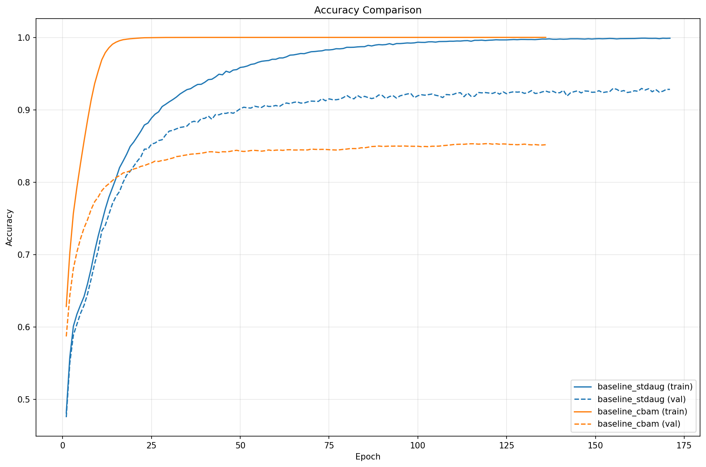
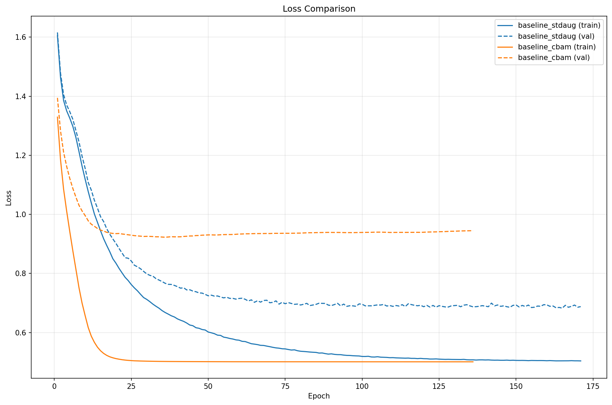

# Weekly Result

## Result Card

| Exp ID | Exp Name | Model | Resolution | Epoch | Optimizer | Top-1 | Weight |
|----------|-------|------------|-------|-----------|-------|--------|--------|
| exp251024_104137 | baseline_stdaug | - | - | 155 | AdamW | 0.9458 | [model](https://github.com/wyywnab/machine_learning_study/tree/main/week5/scripts/experiments/exp251024_104137/model_final_epoch_155.pth) |
| exp251024_120200 | baseline_cbam | - | - | 120 | AdamW | 0.8494 | [model](https://github.com/wyywnab/machine_learning_study/tree/main/week5/scripts/experiments/exp251024_120200/model_final_epoch_120.pth) |


## Plots

### Accuracy


### Loss


## Reproduce

 - One-key Script:

 ```bash
    reproduce.sh -m check                           # Environment Check
    reproduce.sh -m train -e exp251022_172342       # Train
    reproduce.sh -m predict -e exp251022_172342     # Predict
    reproduce.sh -m download -e exp251022_172342    # Download Model
 ```

## Environment

| Item | Version |
|------|---------|
| PyTorch | 2.7.1+cu126 |
| TorchVision | 0.22.1+cu126 |
| CUDA | 12.6 |
| Driver | 550.54 |
| GPU | Tesla V100-SXM2-32GB |